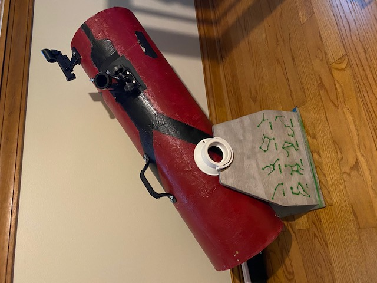
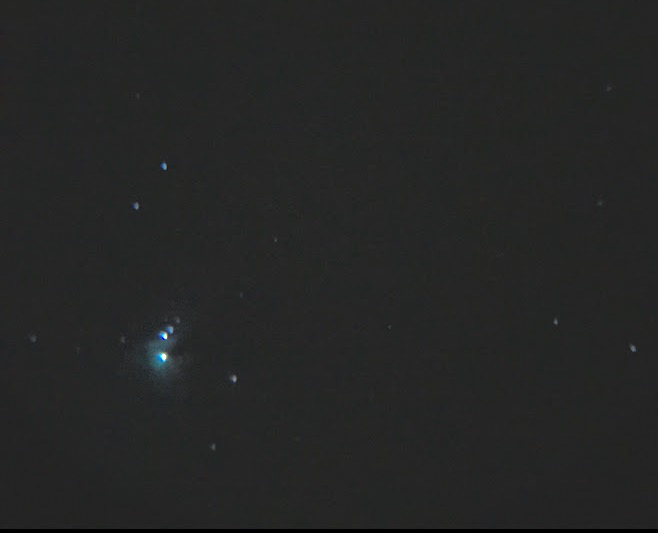

Due to the pandemic, my planned summer 2020 internship got cancelled so instead I took on a personal passion project of building a homemade telescope. I decided that I wanted to make a reflecting, dobsonian 8 inch telescope so I could do planetary astrophotography and hopefully observe some deep space objects like nebulae and globular clusters. I purchased the primary and secondary mirror from an online seller and used a fiberglass reinforced concrete tube as my body. I first had to find the focal length of the telescope using some basic optics knowledge so I could cut the body tube to the appropriate length.

After this, I created a cradle using some PVC drains and a homemade wooden yoke. I painted some common constellations on the sides of my yoke so I could teach my residents at Purdue some astronomy basics whenever I brought it out. It has been a great experience to be able to go out with my own telescope and see significant astronomy events like the opposition of Mars, the conjunction of Jupiter and Saturn, supermoons and full moons. It was a further joy to be able to share this experience with others, many of whom have never seen the moon through a telescope before.

My next step is to begin working on a star tracking mount that will allow me to get longer exposure times of the objects I am trying to photograph. This will help combat light pollution and give me a clearer image. In order to do this I need to write a program that can use my current latitude and longitude to control an azimuth motor and an elevation motor in order to keep my telescope on target.

Final Telescope:

 

Moon:

  

Orion Nebula (M42):

